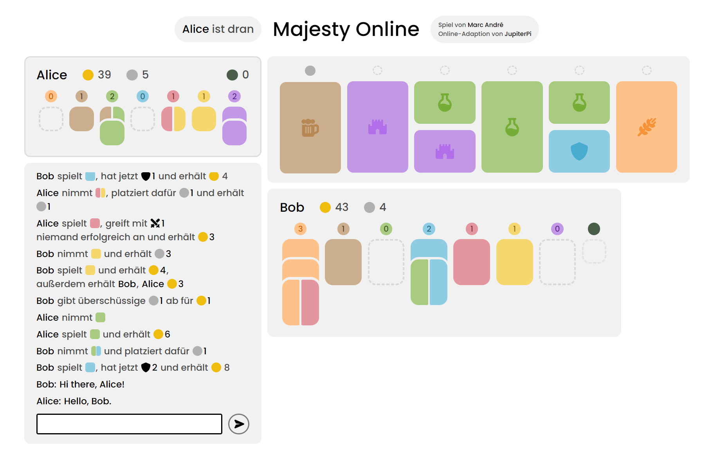

# Majesty Online

Online game adaptation of [Majesty by Marc André](https://boardgamegeek.com/boardgame/230080/majesty-realm)

## How to play

At this moment, you have to build and host Majesty yourself in order to play:

1. Create a server directory. 
2. Build the client in `majesty-client`: `npm install`, then `ng build` and copy `dist` over to your server directory.
3. Build the server in `majesty-server`: `gradlew shadowJar` and copy `build/libs/majesty-server-all.jar` to your server directory.

You can then start your server by running `java -jar majesty-server-all.jar` in the server directory. Majesty Online will be reachable at port 8080 (configurable in code). If you want to play with other players in another network, you must configure port forwarding. 
